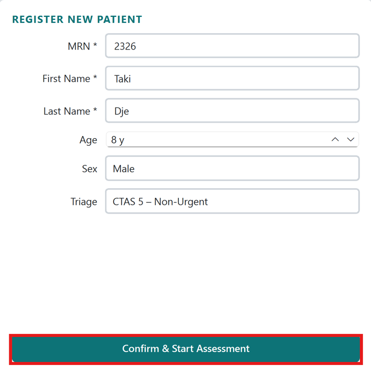
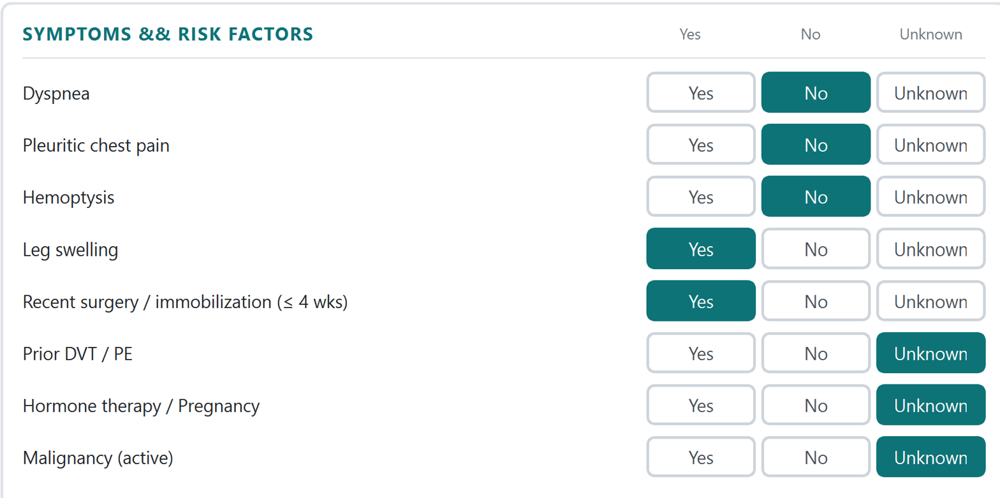
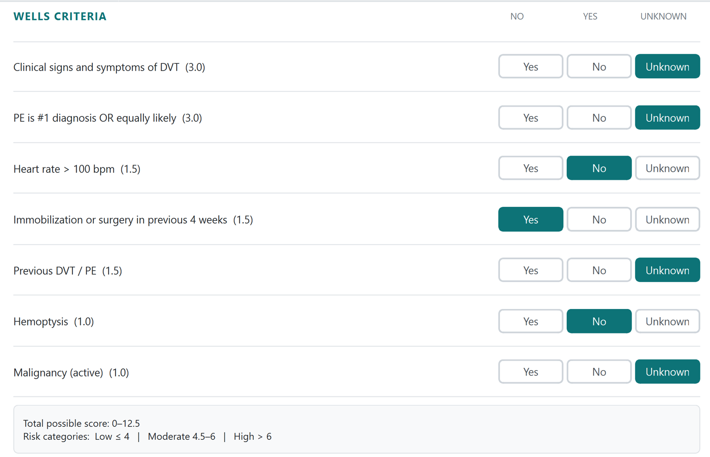
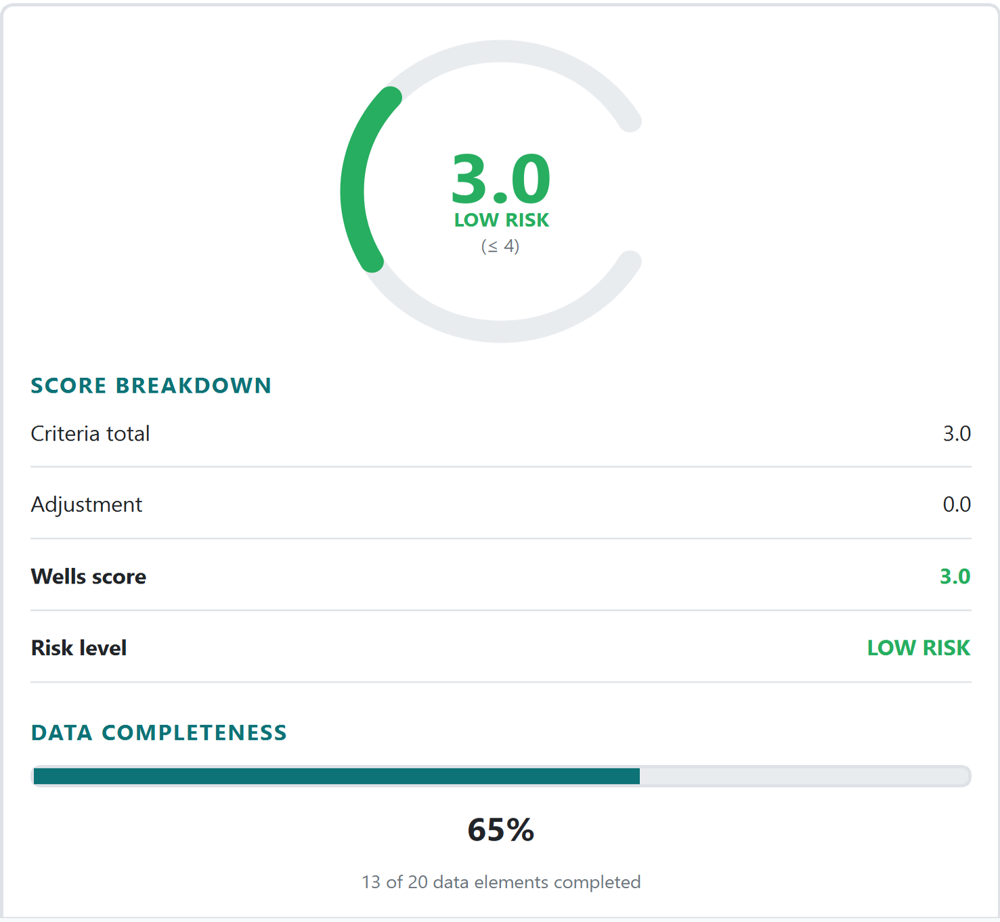
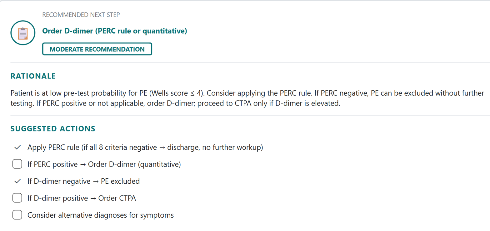
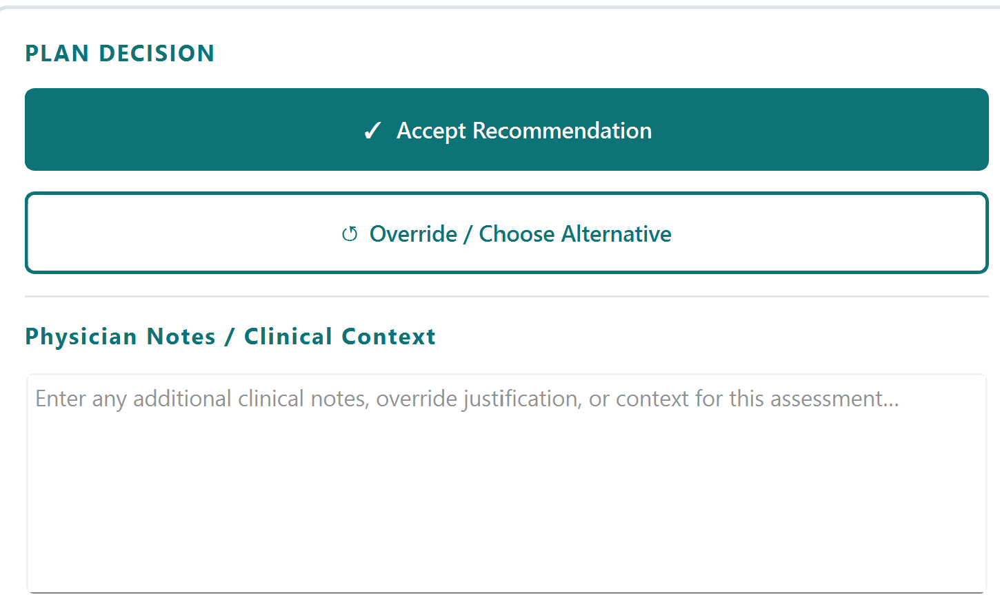
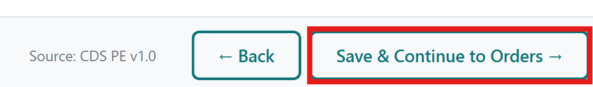
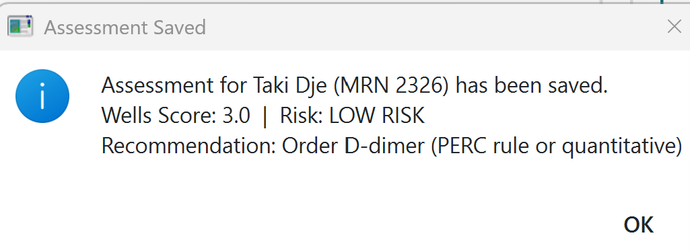

# Pulmonary Embolism CDSS

## 1. Overview

CDS PE is a desktop application that assists clinicians in evaluating Pulmonary Embolism (PE) risk using the Wells Score criteria. It guides the user through a structured four-step workflow, including patient selection, data entry, Wells Score calculation, and evidence-based recommendations.

## 2. How to Use the Interface

The application follows a four-step linear workflow. Navigation is done using the **Back** and **Next** buttons at the bottom of each page. The step indicator at the top shows your current position.

## 3. Workflow

The application follows a four-step assessment process:

### Step 1: Patient Selection

**What it does:** Search for existing patients or register a new one.

**Left panel:** Registered Patients

- Type a name or MRN in the search box to filter the patient table in real time.
- Click a row to select a patient, then click Load Selected Patient or double-click the row to proceed.
- Risk levels in the table are color-coded: red for HIGH, orange for MODERATE, green for LOW.
- Click View Patient History to open the assessment history dialog for the selected patient.

**Right panel:** Register New Patient

- Fill in MRN (required), First Name (required), Last Name (required), Age, Sex, and Triage level.
- Click **Confirm & Start Assessment** to begin.
- If the MRN already exists, the application will prompt you to load the existing record instead.

---

## Step 2: Data Entry

**What it does:** Enter the patient's clinical data including vitals, laboratory results, and symptoms.

**Patient header bar**

- Displays the current patient's name, MRN, age, sex, and triage level.
- Shows a color-coded PE risk badge based on any previously calculated Wells score.
- Triage level can be updated directly from this page via the dropdown.

---

### Left Panel: Vital Signs and Labs

- Enter vital signs: HR (bpm), BP (mmHg), RR (/min), SpO₂ (%), Temperature (°C).
- Enter laboratory results: D-dimer (ng/mL), Troponin (ng/L), BNP (pg/mL), Creatinine (µmol/L).
- All fields only accept numeric input — letters and special characters are blocked.

---

### Right Panel: Symptoms and Risk Factors

- For each of the eight clinical items, select **Yes**, **No**, or **Unknown** using the tri-state button group.
- Items include: dyspnea, pleuritic chest pain, hemoptysis, leg swelling, recent surgery or immobilization, prior DVT/PE, hormone therapy or pregnancy, active malignancy.

---

### Automatic Field Carry-Forward

When you click **Next**, the following symptom fields are automatically mapped to the corresponding Wells criteria on the next page:

- Hemoptysis → Wells hemoptysis criterion  
- Malignancy → Wells malignancy criterion  
- Prior DVT/PE → Wells previous DVT/PE criterion  
- Recent surgery → Wells immobilization criterion  
- HR > 100 bpm (based on entered HR value) → Wells heart rate criterion  

---

## Step 3: Wells Score

**What it does:** Calculate the Wells Score from the seven clinical criteria and display the risk level.

### Left Panel: Wells Criteria

- Seven criteria are displayed with their point values.
- For each criterion, select **No**, **Yes**, or **Unknown**.
- Criteria pre-populated from Step 1 will already be set when this page loads.
- The score updates in real time as you change any selection.

---

### Right Panel: Score Breakdown

- A circular arc gauge displays the current score and risk level with color coding.
- The breakdown table shows criteria total, adjustment, final Wells score, and risk classification.
- A progress bar shows data completeness as a percentage of all key assessment fields filled.

---

### Risk Thresholds
| Wells Score | Risk Level     |
|------------|----------------|
| ≤ 4.0      | LOW RISK       |
| 4.5 – 6.0  | MODERATE RISK  |
| > 6.0      | HIGH RISK      |

Click **Next →** to commit the score and proceed. The Wells score and risk level are saved to the patient record at this point.

---

## Step 4: Recommendations

**What it does:** Display the evidence-based recommendation and record the physician's clinical decision.

### Left Panel: Recommendation

- Displays the recommended next step, recommendation strength, clinical rationale, and a list of suggested actions.
- Suggested actions are shown as checkboxes for the clinician to work through.
- Content is determined automatically by the risk level calculated in Step 2.
### Recommendation Logic by Risk Level

The following table summarizes the automated clinical decision logic based on the calculated Wells risk level:

 

| Risk Level    | Recommended Action |
|--------------|--------------------|
| HIGH RISK     | Order D-dimer; if positive or unavailable proceed to CTPA |
| MODERATE RISK | Order D-dimer; if negative PE excluded; if positive proceed to CTPA |
| LOW RISK      | Apply PERC rule; if positive order D-dimer; proceed to CTPA only if elevated |

**Right Panel:** Plan Decision

- Click ✓ **Accept Recommendation** to record agreement with the system recommendation.
- Note: Once you click ✓ **Accept Recommendation**, the Override button is disabled for the current session. If you need to change your decision, click ← **Back** to return to the Wells Score page and then proceed forward again to reset the Recommendations page.
- Click ↺ **Override / Choose Alternative** to reveal the override reason dropdown — a reason must be selected before saving.
- Add any additional clinical context in the Physician Notes free-text field.
- Click **Save & Continue to Orders →** to finalize.

The system validates that a decision has been made and, if overriding, that a reason has been selected.

- On success, a confirmation dialog shows the saved score and recommendation, and the application returns to the patient selection page.

