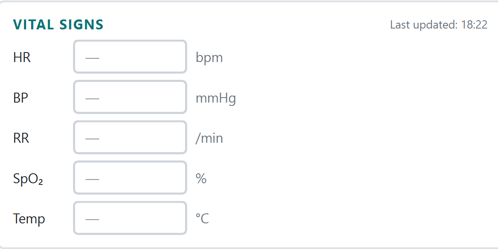
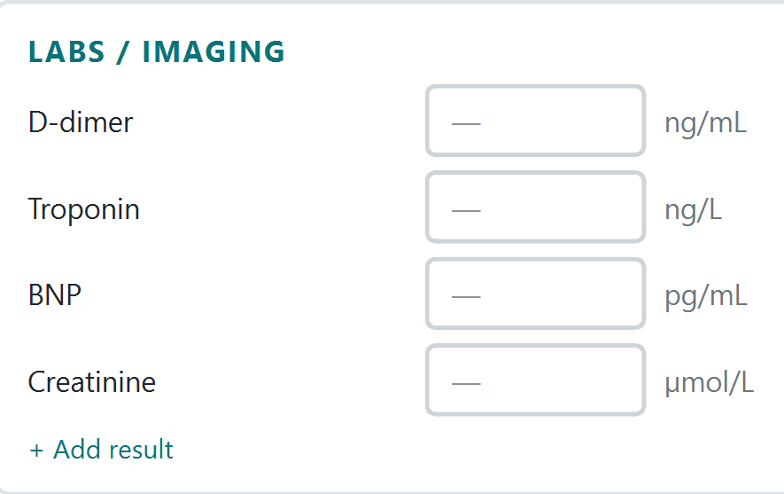

# Pulmonary Embolism CDSS

## 1. Overview

CDS PE is a desktop application that assists clinicians in evaluating Pulmonary Embolism (PE) risk using the Wells Score criteria. It guides the user through a structured four-step workflow, including patient selection, data entry, Wells Score calculation, and evidence-based recommendations.

## 2. How to Use the Interface

The application follows a four-step linear workflow. Navigation is done using the **Back** and **Next** buttons at the bottom of each page. The step indicator at the top shows your current position.

## 3. Workflow

The application follows a four-step assessment process:

### Step 1: Patient Selection

**What it does:** Search for existing patients or register a new one.

**Left panel:** Registered Patients

**Instructions:**

- Type a name or MRN in the search box to filter the patient table in real time.
- Click a row to select a patient, then click Load Selected Patient or double-click the row to proceed.
- Risk levels in the table are color-coded: red for HIGH, orange for MODERATE, green for LOW.
- Click View Patient History to open the assessment history dialog for the selected patient.

**Right panel:** Register New Patient

### Step 1: Patient Selection

**What it does:** Search for existing patients or register a new one.

**Instructions:**

- Fill in MRN (required), First Name (required), Last Name (required), Age, Sex, and Triage level.
- Click **Confirm & Start Assessment** to begin.
- If the MRN already exists, the application will prompt you to load the existing record instead.

---

## Step 2: Data Entry

**What it does:** Enter the patient's clinical data including vitals, laboratory results, and symptoms.

**Patient header bar**

### Step 2: Data Entry

**What it does:** Enter the patient's clinical data including vitals, laboratory results, and symptoms.

**Patient header bar:**

- Displays the current patient's name, MRN, age, sex, and triage level.
- Shows a color-coded PE risk badge based on any previously calculated Wells score.
- Triage level can be updated directly from this page via the dropdown.

---

### Left Panel: Vital Signs and Labs

### Left Panel: Vital Signs and Labs

**Instructions:**

- Enter vital signs: HR (bpm), BP (mmHg), RR (/min), SpO₂ (%), Temperature (°C).
- Enter laboratory results: D-dimer (ng/mL), Troponin (ng/L), BNP (pg/mL), Creatinine (µmol/L).
- All fields only accept numeric input — letters and special characters are blocked.

---

### Right Panel: Symptoms and Risk Factors

